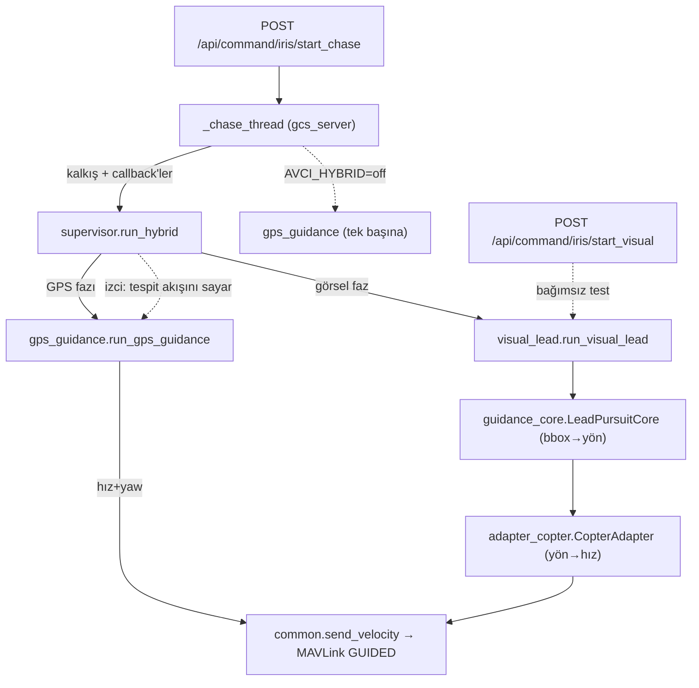

# Güdüm Sistemi — Mevcut Mimari

> **Durum:** GERÇEKLİK (kodda şu an çalışan sistem). Vizyon/plan için ayrıca
> [`GUIDANCE_ROADMAP.md`](GUIDANCE_ROADMAP.md).
> **Kapsam:** `control/guidance/` paketi + `control/gcs_server.py` giriş noktaları.

Avcı drone (ArduCopter, quad), hedef İHA'yı (Talon, ArduPlane) hava-havada
kovalayıp vurur. Güdüm iki fazlı: **GPS fazı** hedefi kamera kadrajının merkezine
ve tespitin çalıştığı menzil bandına oturtur, **görsel IBVS** kilitlenip vurur.
Bir denetleyici (supervisor) iki faz arasında geçiş yapar.

---

## 1. Veri akışı

**Varsayılan görev yolu:** `start_chase` → `_chase_thread` (port bağlantısı +
kalkış) → `supervisor.run_hybrid` → GPS ↔ görsel geçişli döngü → `CopterAdapter`
veya `gps_guidance` → `common.send_velocity` → ArduCopter GUIDED.

**Yan giriş noktaları:**
- `AVCI_HYBRID=off` → hibrit yerine saf `gps_guidance` (GPS'i tek başına test için).
- `POST /api/command/iris/start_visual` → `_visual_thread` → `run_visual_lead`
  doğrudan (görsel hattı izole test; supervisor yok).

Hedefin GERÇEK NED pozu (`get_plane_truth`) yalnız `menzil_gercek` **logu** ve
terminal vuruş tespiti için; güdüm hesabına GİRMEZ (gerçek donanımda yakınlık
sensörü yerini alır). Güdüm, hedefin GPS-gürültülü telemetrisini (`get_plane`)
ve kameranın detection çıktısını kullanır.

### Tespit → kilit zinciri (gcs `process_iris_frame`)

Her karede tek YOLO çıkarımı: `detect_all(conf=0.1)` ham tespitleri hem
**HybridSORT** takipçisine (`vision/tracker.py`, `AVCI_TRACKER=off` kapatır)
hem `best_det`'e verir. `set_detection`'a giden kutu **kilitli-ID politikası**
(`TargetLock`, `AVCI_LOCK=off` → eski "en yüksek conf" seçimi): kilitli track
eşleşmişse onun kutusu (`det["track_id"]` eklenir; anlık FP hedefi tek karede
çalamaz), kilit coast'taysa `det=None` (Kalman tahmini nişan olarak KULLANILMAZ
gider), kilit yoksa ham `best_det`. Korumalar: kilit yalnız conf≥0.5 onaylı
track'e; sıçrama koruması (kutu tek karede >3× köşegen atlarsa kilit düşer);
çelişki koruması (güçlü tespit 10 kare başka yerdeyse tazelenir). Ayrıca
`control/sim_truth.py` gz'den gerçek menzil + fiziksel TEMAS olayını dinler —
yalnız GÖZLEM (terminal `[TRUTH]` satırları); güdüm kararlarına bağlı değildir.

---

## 2. Modüller (`control/guidance/`)

| Dosya | Sorumluluk | Girdi → Çıktı |
|---|---|---|
| `common.py` | Paylaşılan matematik + tek MAVLink göndericisi | `clamp/normalize_angle/vec3_len/limit_acceleration`, `send_velocity(conn, vx,vy,vz, yaw)` |
| `guidance_core.py` | **Platformdan bağımsız** IBVS çekirdeği (bbox→yön) + frame dönüşümleri | detection kutusu + attitude → `u_govde` (saf takip yönü FRD) + `yaw_hata/pitch_hata` + kalite |
| `adapter_copter.py` | Copter adaptörü: nişan yönü → multirotor komutu | `u_govde` → NED hız (`V_KAPANMA`) + slew-limitli yaw; dikey yumuşatma/PN/co-altitude; ivme sınırı |
| `gps_guidance.py` | GPS fazı: kadraj merkezleme (geometrik istasyon + PD hız + hedef-hızı feedforward) | `get_plane/get_iris` → hız+yaw setpoint (20 Hz) + CSV log |
| `visual_lead.py` | Görsel IBVS döngüsü (kameraya kilitli, olay güdümlü) + CSV log + kör-dalış + **B5 fly-past** | kare akışı → çekirdek → adaptör → `send_velocity` |
| `supervisor.py` | Faz 4: GPS ↔ görsel geçiş denetleyicisi | tek görev döngüsü `run_hybrid` |
| `__init__.py` | Paket dokümantasyonu | — |

Bağımlılık grafiği (yaprak → tepe): `common` ve `guidance_core` tabandır;
`adapter_copter` ikisine dayanır; `visual_lead` çekirdek+adaptör+common;
`gps_guidance` common+çekirdek(`hedef_kadraj_hatasi`);
`supervisor` gps_guidance+visual_lead+çekirdek(Cfg).

---

## 3. İki faz

### GPS fazı (`gps_guidance.py`)
**Amacı vuruş değil, kadraj merkezleme.** Başarı ölçütü: hedef kameranın tam
ortasında, tespitin güvenilir çalıştığı menzil bandında (~10-11 m) ve
kararlı görünsün → supervisor görsel faza devretsin. 20 Hz döngü:

- **Geometrik kadraj noktası (istasyon):** slant menzil `RANGE_SET` (11 m) ve
  `ISTASYON_ELEV_DEG` (15°) bir istasyon noktası belirler: hedefin
  `RANGE_SET·cos15° ≈ 10.63 m` **gerisi** + `RANGE_SET·sin15° ≈ 2.85 m` **altı**.
  Hedef kadrajda, merkezin ~10° altında görünür (v≈269/480 px — test G7 hem
  açıyı hem kenar payını doğrular).

  > **İstasyon açısı kamera tilt'inden neden ayrı?** 2026-08-02'ye kadar tek
  > sayıydı (25°) ve istasyon 4.65 m altta kuruluyordu. Üç uçuşun kara kutusu
  > gösterdi ki ArduPilot dikey hız komutunu `WP_ACC_Z = 1.0 m/s²` ile
  > rampalıyor — güdüm 8-22 m/s tırmanma istese de. Sıfırdan 4.65 m kapatmak
  > 3.05 s sürer, terminalde 2.4-2.8 s var. Sonuç: drone hedefin **altından**
  > geçiyordu (kalan dikey +1.52 m ve +2.06 m; vurabilen tek koşuda +0.03 m).
  > 15°'de kapatılacak mesafe 2.85 m'ye iniyor ve ivme bütçesine sığıyor
  > (test **G11** bunu koruyor). Ayar: `AVCI_GPS_ISTASYON_ELEV`.
- **"Geri" yönünün seçimi:** hedefin yatay hızı `TRACK_MIN_SPD` (3 m/s) üstündeyse
  **hız yönünün gerisi** (kuyruk takibi), altındaysa **LOS gerisi** (drone tarafı)
  — duran/yavaş hedefte hız yönü gürültülü olduğu için.
- **Alttan bakış (look-up):** istasyon hedefin altında olduğundan hedef gökyüzü
  önünde siluet kalır, kamera 25° yukarı tilt'li → tespit kopmaz.
  `LOOKUP_MIN_ALT` (8 m) yere
  çakılmayı önler.
- **Hız komutu:** hedef-hızı **feedforward** + istasyon hatasına **PD**
  (`KP_H/KD_H` yatay, `KP_Z` dikey). Feedforward sayesinde kilitlenince drone
  hedefin hızıyla birlikte gider — kararlı hold, sürekli kovalama salınımı yok.
  `V_MAX`, `VZ_MAX` ve `MAX_ACCEL` ile sınırlanır.
- **Yaw:** burun daima **gerçek hedefe** döner (istasyona değil), rate-limitli.
- **Kadraj hatası ölçümü:** her karede `guidance_core.hedef_kadraj_hatasi` ile
  drone'un GERÇEK attitude'undan azimut/yükseliş hatası ve piksel (u,v) kapalı
  formda hesaplanıp CSV'ye yazılır → merkezleme başarısı ölçülebilir.
- **Tazelik:** hedef telemetrisi `HOLD_S` (3 sn) donuk kalırsa `DROPOUT` — hover
  edilir ve supervisor jamming fallback'i devreye alır.
- **Devir etiketi:** `d_h < HANDOFF_RANGE` (20 m) → `durum=KILIT`; supervisor bunu
  görsel kilit sayacıyla birleştirir.

> **Kademe notu:** Bu sürüm KADEME 1 — istasyon geometrik olarak kurulur.
> KADEME 2'de ölçülen kadraj hatası doğrudan geri beslemeye girecek.

### Görsel IBVS (`visual_lead.py` + `guidance_core.py` + `adapter_copter.py`)
Sabit Hz'te DÖNMEZ — kamera karesi (30 Hz) geldikçe işler. Her kabul edilen karede:
1. **Çekirdek (`LeadPursuitCore.process`):** detection kutusunun MERKEZİNDEN
   saf takip yönünü, GENİŞLİĞİNDEN ölçek/kaliteyi üretir. Çıktı bir **yöndür**
   (`u_govde`, FRD); menzil güdüme girmez (`menzil_kestirim_m` yalnız log).
   Lead burada ÜRETİLMEZ — çekirdek yalnız "hedef nerede" sorusunu cevaplar.
2. **Adaptör (`CopterAdapter.compute`):** yönü dünya-NED hız vektörüne çevirir
   (`V_KAPANMA`), iki kanalda lead uygular —
   **yatay** `_yatay_pn` (LOS azimut oranıyla orantılı öne nişan; pose
   şekil-lead'inin halefi) ve **dikey** `_dikey_pn` (yumuşatma + PN lead +
   kadraj tutma + terminal co-altitude). Ardından ivme sınırı ve slew-limitli
   yaw. `SET_ATTITUDE_TARGET` kullanılmaz (multirotorda yanlış araç).
3. **Alt-fazlar:** `menzil > TERMINAL_MENZIL` (8 m) ve ≤ `YAKLASMA_MAX_MENZIL`
   (18 m) → **YAKLAŞMA** (yatay `V_YAKLASMA`, dikey irtifa eşitleme);
   altında → **TERMINAL** (tam `V_KAPANMA`, `VZ_TERMINAL_MAX` dikey tavanlı).
4. **Terminal kör-dalış:** menzil `TERMINAL_MENZIL` altında iken temas koparsa
   GPS'e DÖNMEZ; son nişan komutunu `TERMINAL_SURE` boyunca sürdürür.
   `VURUS_MENZIL` (1.5 m) altı yalnız temas sensörü yoksa YEDEK vuruş ölçütüdür.
5. **B5 fly-past:** hedef geçildiyse (en yakın noktadan `FLYPAST_BUYUME_M`
   uzaklaşma, veya nişan geriyi gösteriyor) görsel faz bırakılır ve faz
   bitişinde **sıfır hız komutu** gönderilir — MAVLink hız komutu kalıcıdır,
   göndermeyi bırakmak "dur" demek değildir.

### Geçiş mantığı (`supervisor.run_hybrid`)
Tek görev döngüsü. `izci()` alt-thread'i tespit akışını sayar:
- **GPS → görsel:** `KILIT_PENCERE` (15) karenin `KILIT_N` (10) tanesinde güvenli tespit (conf ≥ `POSE_CONF_MIN`)
  **VE** kapı: `d_h < GATE_MENZIL` (20 m) **YA DA** GPS `DROPOUT` (jamming fallback).
- **görsel → GPS:** temas kaybı (kayan pencere) · kare akışının durması · **hedefin geçilmesi (B5 fly-past)**.
- **Bitiş:** `run_visual_lead` `"vuruldu"` dönerse görev tamamlanır (`faz=VURULDU`);
  `stop_chase` gelirse durur.

Menzil kapısının nedeni: görsel fazın kapanma hızı sabit; uzaktan erken geçilirse
hızlı hedefe yetişilemez. Tespit asıl 10-12 m'de sağlam; kapı 20 m bandı seçer.

---

## 4. Config yüzeyi

Üç ayrı config; **bilinçli olarak** ayrı tutuluyor (birleştirme rebuild fazına ertelendi):

| Sınıf | Dosya | Alan (domain) | Örnek parametreler |
|---|---|---|---|
| `Cfg` | `guidance_core.py` | **IBVS/görsel** | `BBOX_L_ETKIN_M`, `V_KAPANMA`, `V_YAKLASMA`, `KP_YAW`, `IVME_TAVAN`, `TERMINAL_MENZIL/SURE`, `VURUS_MENZIL`, `PN_LEAD_SURE`, `PN_YATAY_SURE`, `YAW_SUS_N`, `FLYPAST_*` |
| `Cfg` | `gps_guidance.py:43` | **GPS fazı (kadraj)** | `RANGE_SET`, `CENTER_ELEV_DEG`, `TRACK_MIN_SPD`, `LOOKUP_MIN_ALT`, `KP_H/KD_H`, `KP_Z/VZ_MAX`, `V_MAX/MAX_ACCEL`, `HANDOFF_RANGE`, `POS_EMA/VEL_EMA`, `HOLD_S` |
| `SupCfg` | `supervisor.py` | **geçiş** | `KILIT_N`, `KILIT_PENCERE`, `KAYIP_M`, `POSE_CONF_MIN`, `GATE_KILIT`, `GATE_MENZIL` |

> **Not:** İki config sınıfı da `Cfg` adında; `supervisor` içine `LeadCfg` olarak
> import edilir. İsim çakışması yalnız kozmetik (Python ayırır). Birleştirme/yeniden
> adlandırma bilinçli olarak **rebuild fazına** bırakıldı (config o zaman yeniden tasarlanacak).

**Ortam değişkenleri** (canlı ayar; `_env_f` = float okuyucu):
`AVCI_IBVS_BBOX_L`, `AVCI_IBVS_V_KAPANMA`, `AVCI_IBVS_TERMINAL_MENZIL`,
`AVCI_IBVS_TERMINAL_SURE`, `AVCI_IBVS_VURUS_MENZIL`, `AVCI_IBVS_PN_SURE`,
`AVCI_IBVS_COALT_MENZIL`, `AVCI_IBVS_PN_YATAY_SURE`, `AVCI_IBVS_BBOX_L`,
`AVCI_GT_ROT` (guidance_core);
`AVCI_GPS_RANGE` (gps_guidance: slant menzil setpoint);
`AVCI_HYBRID_GATE_MENZIL` (supervisor); `AVCI_HYBRID` (gcs_server: hibrit/saf-GPS seçimi).

---

## 5. Frame ve geometri sözleşmeleri

Tüm dönüşümler `guidance_core.py`'de tek noktada:
- **`kamera_to_govde(u, tilt)`** — OpenCV kamera (X sağ, Y aşağı, Z ileri) → gövde
  FRD (X ileri, Y sağ, Z aşağı). Montaj **25° yukarı tilt** Ry ile uygulanır
  (atlanırsa sürekli 25° sabit hata). Doğrulama: merkez → `[0.906, 0, -0.423]`.
- **`govde_to_dunya(u, roll, pitch, yaw)`** — gövde FRD → dünya NED, DCM = Rz·Ry·Rx.
- **Look-up düzeltmesi** (`yukselti_duzeltme`) — LOS'un yatayla açısına göre ölçek
  düzeltmesi (alttan yaklaşmada gövde/kanat izdüşümü kısalmasını telafi eder).
- Kamera intrinsics tek dış bağımlılık: `vision.geometry` (`FX/FY/CX/CY`).

Görüş zarfı (640×480, HFOV 125°): kadraj tepesi ≈ +80° yükseliş, tabanı ≈ −30°,
merkez = boresight +25° (kamera tilt'i).

---

## 5b. GT modu (`AVCI_GT_ROT=on`) — yalnızca teşhis aracı

⚠ **VARSAYILAN KAPALI ve öyle kalmalı.** `scripts/gcs.sh` varsayılan modu
`bbox`, o da `AVCI_GT_ROT=off` export eder. Bu mod **simülasyona özgüdür** —
gerçek harekâtta hedefin pozu bilinmez, uçurulamaz.

Açıkken görsel güdümün **tüm algı girdileri** kameradan değil Gazebo'nun
gerçek pozundan gelir:

| Girdi | bbox modu (VARSAYILAN) | GT modu (teşhis) |
|---|---|---|
| Nişan noktası | detection kutusunun merkezi | hedefin izdüşümü (`bbox_gt_goruntu.uv`) |
| Ölçek (`olcek`) | kutunun genişliği `w` | `fx·L/R`, gerçek menzilden |
| Güven/kalite kapıları | detection conf + ölçek rampası | devre dışı (güven = 1.0) |

**Geri kalan geometri iki modda da aynıdır** — değişen yalnız algının nereden
beslendiğidir. Bu kasıtlı: aynı yasa, farklı algı → CSV sütunları birebir
kıyaslanabilir. Iska varsa suç GT modunda **yasada**, bbox modunda **algıdadır**.

Akış: `sim_truth.pozlar()` (iki araç TEK gz mesajından, zaman hizalı) →
`geometry.bbox_gt_goruntu()` → `gcs_server._gt_bbox_girdi()` → `visual_lead` →
`guidance_core.process(..., gt=...)`.

GT modunda "görsel temas"ın anlamı *kutu var mı* yerine *GT akışı canlı mı*dır;
tespit kaybı GPS'e döndürmez. Supervisor'ın geçiş kapısı yine de görsel kilide
bakar (`AVCI_GT_KILIT_BYPASS` ile atlanabilir ama **ölçümle çürütüldü** —
devir 6.6 → 19.6 m'ye kaçıyor, bkz. `supervisor.SupCfg`).

---

## 6. Test ve loglar

- **Görsel hat testleri:** `python3 -m tests.test_visual_lead` — 30 senaryo (T1-T30);
  çoğunlukla `guidance_core` (T1-16,21) ve `adapter_copter` (T17-20,27-29), ayrıca
  `supervisor` geçiş zinciri (T22-23) ve `visual_lead` terminal (T24-26).
- **GPS fazı testleri:** `python3 -m tests.test_gps_guidance` — 9 senaryo (G1-G9):
  kadraj hatası matematiği (G1-G6), istasyon geometrisinin merkezleme tutarlılığı
  (G7-G8) ve sahte bağlantıyla döngü duman testi (G9).
- **GT modu testleri:** aynı dosyada T49-T54 — kadraj merkezi (T49),
  kutusuz çalışma (T50), gerçek menzilden ölçek (T51), gerçek kutu boyutu (T52),
  **GT yolu ≈ kusursuz bbox yolu** (T53: Δyaw < 2°) ve `gt=None` regresyonu (T54).
- **B5 testleri:** T60 (fly-past tetiklenir), T61 (kapanan menzilde yanlış alarm
  yok), T62 (faz sonu hız komutu sıfırlanır), T63 (kadraj kenarı 'arka' sayılmaz).
- **Yaw kilidi testleri:** T45/T45b (görsel) ve G13/G15 (GPS) — susma SÜRELİ,
  kilitlenmiyor.
- **Ölçüm aracı testleri:** `python3 -m tests.olcum_araclari` — 22 senaryo;
  güdümü değil `tools/` altındaki ölçüm araçlarını denetler: kara kutu
  geometrisi ve zaman hizalama (E1-E8), CSV karne metrikleri (K1-K8),
  parametre denetimi (P1-P6). Araçlar uçuş kaydı okur ve kayıtlar depoda
  yoktur; test edilen kısım içlerindeki **saf hesap**.
- **Bilinen boşluk:** `supervisor`ın gerçek döngüsü ve `common` doğrudan testsiz.
- **Uçuş logları:** her faz kendi CSV'sini yazar —
  `logs/visual_lead_<zaman>.csv` (kutu ölçümleri, nişan yönü, komutlar,
  `yatay_lead_deg`, `pn_dikey_deg`, `coalt_deg`, `alt_faz`, `en_yakin_m`,
  `menzil_gercek_m`) ve
  `logs/gps_guidance_<zaman>.csv` (istasyon, komutlar, kadraj açıları, `u_px/v_px`).
  `visual_lead` CSV'sinin varlığı görsel faza gerçekten geçildiğini gösterir.
  Görselleştirme: `python3 tools/gps_log_viz.py --last 6 --open`
  (format: [`GPS_LOGGING.md`](GPS_LOGGING.md)).

---

## 7. Sonraki faz (kapsam dışı)

Bu doküman **temizlenmiş mevcut sistemi** anlatır. Bir sonraki adım: güdüm yasalarını
**sıfırdan, en basit algoritmadan gelişmişine** doğru yeniden inşa etmek (ör. saf
takip → oransal-seyrüsefer/PN → tam kesme). O aşamada:
- İki `Cfg` sınıfı tek tutarlı config'e birleştirilecek.
- `common.py` / `guidance_core.py` frame ve MAVLink tabanı yeniden kullanılacak
  (kanıtlanmış, testli).
- Terminal alttan-geçiş/ıska sorunu temiz tabandan ele alınacak.
