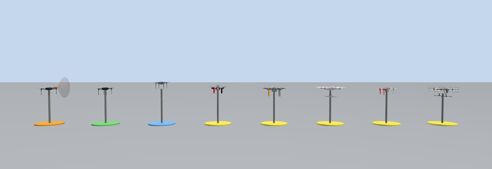
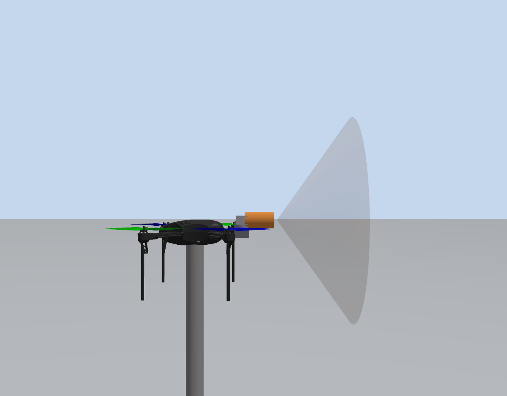
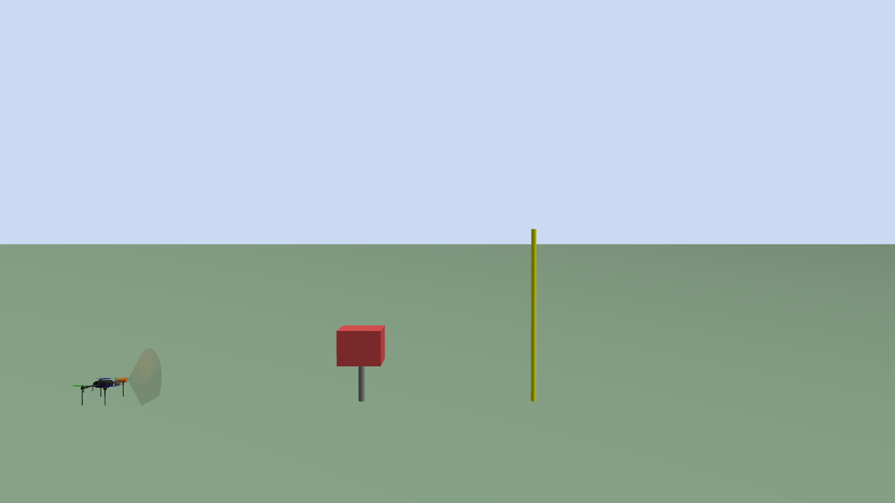

# Simülasyon Görüntüleri

Tüm görüntüler Gazebo Harmonic'te, sahneye yerleştirilen kamera sensörlerinden
headless olarak alındı (`scripts/51_capture_shots.py`, `scripts/52_action_shots.py`).

---


---

## 1. Vitrin — bütün interceptor adayları yan yana



Soldan sağa (kaide rengi):

| # | Model | Kaide | Kaynak |
|---|---|---|---|
| 1 | **avci_net_interceptor** (taretli + ağlı) | turuncu | bizim ürettiğimiz |
| 2 | `cand_iris` | yeşil | avci_sim iris_cam |
| 3 | `cand_iq_camera` | mavi | Intelligent-Quads/iq_sim (Classic→Harmonic çevrildi) |
| 4 | `cand_mrs_x500` | sarı | ctu-mrs jinja |
| 5 | `cand_mrs_t650` | sarı | ctu-mrs jinja |
| 6 | `cand_mrs_m690` | sarı | ctu-mrs jinja |
| 7 | `cand_mrs_f450` | sarı | ctu-mrs jinja |
| 8 | `cand_mrs_naki` | sarı | ctu-mrs jinja |

Üretmek için:
```bash
source scripts/env.sh
python3 scripts/50_showcase.py
gz sim -s -r --headless-rendering worlds/showcase.sdf &
python3 scripts/51_capture_shots.py
```

Canlı gezmek için: `gz sim -r worlds/showcase.sdf`

---

## 2. Taretli interceptor — yakın plan



Görünen parçalar (soldan sağa):
- **iris gövdesi** — pervaneler, standoff bacaklar (1.75 kg)
- **gri taret bloğu** — pan (yaw) ve tilt (pitch) eklemleri (0.18 kg)
- **turuncu silindir** — namlu, `muzzle_link` (0.07 kg)
- **şeffaf koni** — ağ, `net_cone`, ağzı ileri bakıyor (0.30 kg, 0.7 m ağız çapı)

---

## 3. Ateşleme ve yakalama sekansı

### Atıştan önce


Solda interceptor (namlusunda ağ), ortada direğe oturtulmuş 0.7 kg'lık hedef
kutusu, sağdaki sarı direk 5 m menzil işareti.

### Yakalama anından sonra


Ağ hedefe çarptı, `NetCapturePlugin` çalışma anında `DetachableJoint` yarattı
ve **hedef ağa kilitlendi** — kutu direğinden söküldü, ikisi birlikte gidiyor.
Direk boş kaldı (ortadaki gri çubuk).

Üretmek için:
```bash
source scripts/env.sh
gz sim -s -r --headless-rendering worlds/net_test.sdf &
python3 scripts/turret_aim.py 0 -6            # tareti nişanla
python3 scripts/52_action_shots.py --topic /action/view --kare 8 --aralik 0.10
```

---

## Notlar

- Bu dünyada interceptor **yerde duruyor** (henüz ArduPilot ile uçmuyor).
  Ağ alçak irtifadan atıldığı için zeminde sekebiliyor; isabet bu senaryoda
  tesadüfe açık. Deterministik yakalama ölçümü için `scripts/42_capture_test.sh`
  kullanılır (10 m irtifadan atış, hedef ölçülen yörünge üzerinde, **5/5 başarı**).
- Vitrindeki modeller `models/showcase/` altındaki **görüntü kopyalarıdır**:
  eklentileri çıkarılmış ve statik yapılmıştır. Aynı dünyada 8 canlı model
  olsaydı hepsi aynı ArduPilot FDM portuna bağlanmaya çalışırdı.
