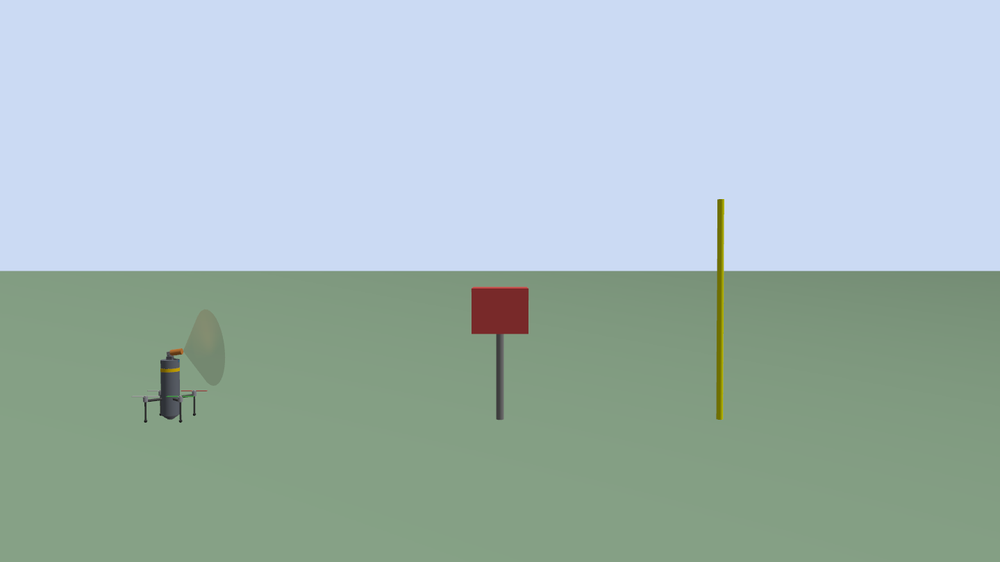
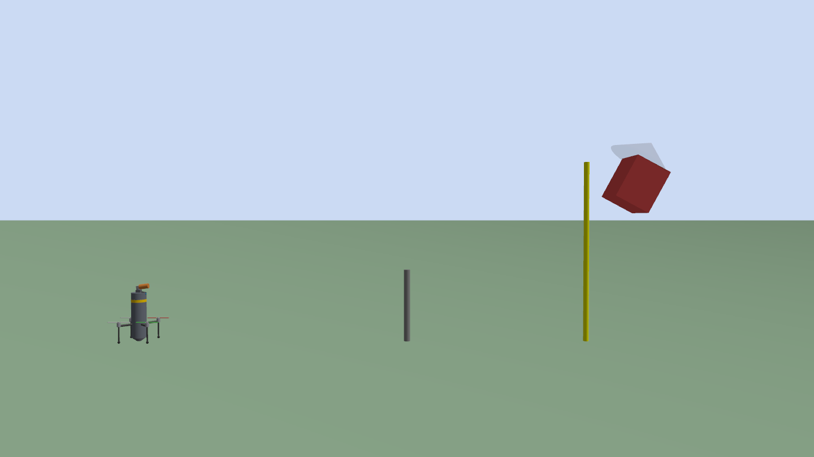
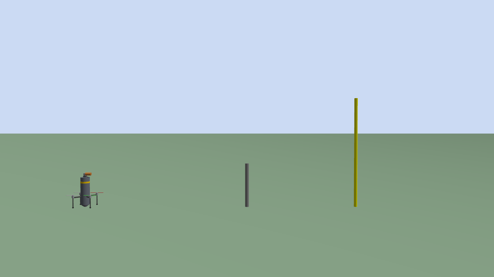

# Simülasyon Görüntüleri

Tüm görüntüler Gazebo Harmonic'te, sahneye yerleştirilen kamera sensörlerinden
headless olarak alındı (`scripts/52_action_shots.py`).

Bu dosya yalnızca `bullet_net_interceptor` (mermi gövdeli, taret tepede)
platformunu belgeler. Aday gövde vitrini ve skycat görüntüleri, ilgili modeller
depodan çıkarıldığı için kaldırıldı.

---

## Mermi gövde — yakın plan



`bullet_net_interceptor`: dikey mermi gövde (r = 8 cm, h = 50 cm), ortasında
turuncu tanıtım bandı, alt-orta bölgeden çıkan 4 kol + rotor + iniş bacağı.
Burun konisinin yerinde **taret** duruyor: koyu kaide, pan silindiri, tilt bloğu
ve öne bakan turuncu **namlu**. Namluya geçmiş yarı saydam ağ konisi hedefe
doğru açık. Sağda direğin üstünde kırmızı hedef kutusu.



Ateşten ~0.2 sn sonra: hedef kutusu direğinden söküldü, ağ üstüne kilitlendi,
ikisi birlikte menzil direklerini geçiyor. Namlu boşaldı.

---

## Ateşleme ve yakalama sekansı

### Atıştan önce


Solda interceptor (namlusunda ağ), ortada direğe oturtulmuş 0.7 kg'lık hedef
kutusu, sağdaki sarı direk menzil işareti.

### Yakalama anından sonra


Ağ hedefe çarptı, `NetCapturePlugin` çalışma anında `DetachableJoint` yarattı
ve **hedef ağa kilitlendi** — kutu direğinden söküldü, ikisi birlikte gidiyor.
Direk boş kaldı.

Üretmek için:
```bash
source scripts/env.sh
gz sim -s -r --headless-rendering worlds/bullet_net_test.sdf &
python3 scripts/turret_aim.py 0 -8
python3 scripts/52_action_shots.py --topic /action/view --kare 6 --aralik 0.10
```

`turret_aim.py`, `fire_net.py`, `turret_state.py` ve `52_action_shots.py` artık
varsayılan olarak `bullet_net_interceptor`'ı sürer; `--model` yazmaya gerek yok.

---

## Notlar

- Bu dünyada interceptor **yerde duruyor** (henüz ArduPilot ile uçmuyor).
  Ağ alçak irtifadan atıldığı için zeminde sekebiliyor; isabet bu senaryoda
  tesadüfe açık. Deterministik yakalama ölçümü için `scripts/42_capture_test.sh`
  kullanılır (10 m irtifadan atış, hedef ölçülen yörünge üzerinde).
- Ölçülen değerler: taret komut −8.00° → **−8.03°**, yakalama tuttu.
  Ağ ileri menzili kaynak dokümanda 27.84 m; `ardupilot_gazebo` yüklüyken
  aynı kurulumda 33.08 m ölçüldü (motor/gövde dinamiği devrede).
